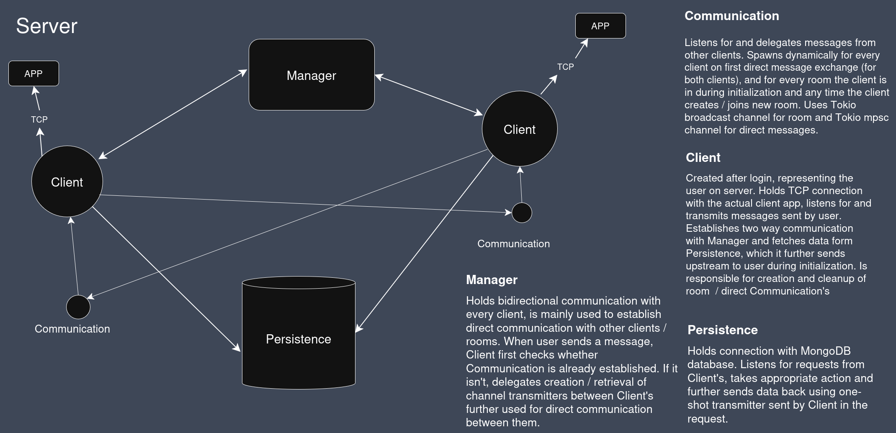
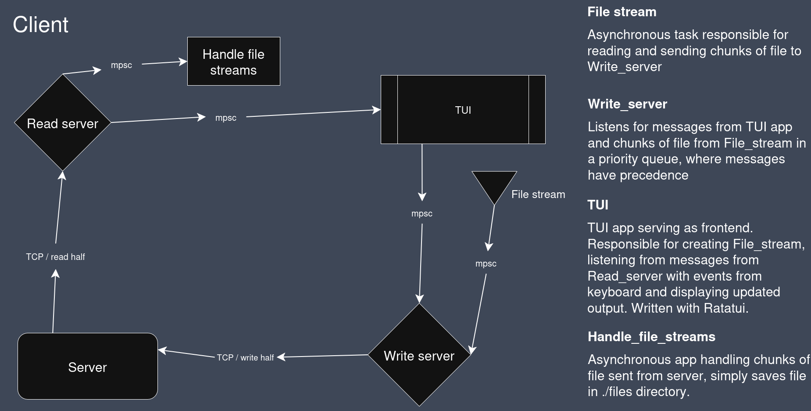

# Rust ChatApp

## About

Project is a chat application build with Tokio server and frontend build as a TUI app. Connection is established using web socket protocol and server also connects to dabatabse for persistence. Purpose of the project was to get more familiar with standard Rust mechanisms and ecosystem to comfortably use to write efficient programs.

## How to start

### ENV variables

- SERVER_HOST ()
- SERVER_PORT
- DB_URL (optional, default docker sets DB image by itself, default locally is set remote database using MongoDB Atlas)

### With Docker

- docker compose up (start server)
- cargo run --bin client --release

### Locally:

- cargo run --bin server --release
- cargo run --bin client --release

### Locally:

## TLC

TCP connection is encrypted by self signed certificate saved in the repo along with the private key. This is obviously not secure and inteded only as personal project practice.

## Architecture

## TODO

- peer to peer communication, where each client is also a server and communicates with other clients through DNS lookup without central server.

docker tag local-image:tagname new-repo:tagname
docker push new-repo:tagname
